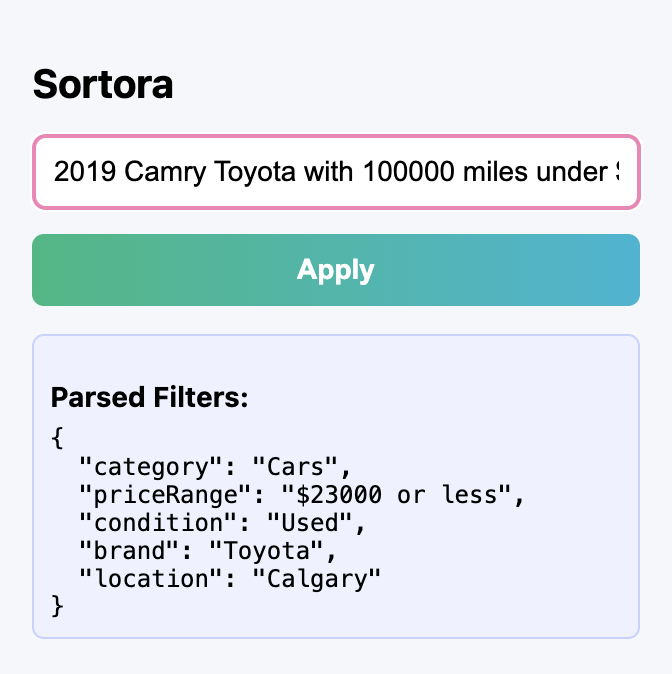
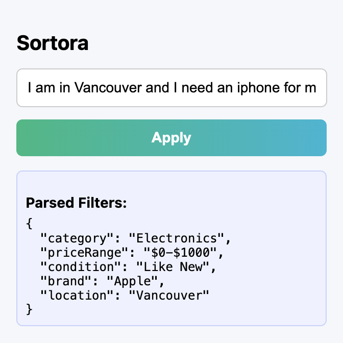
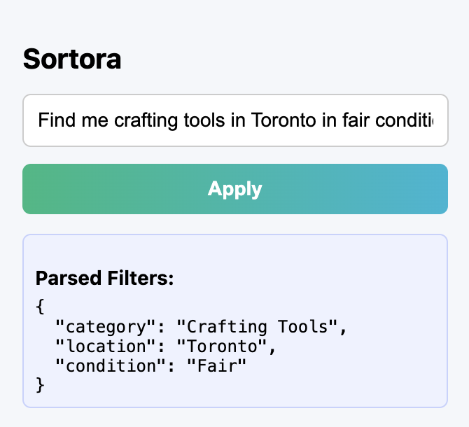

# Sortora: AI-Powered Marketplace Filter Assistant

Sortora is a smart Chrome extension that lets you filter Facebook Marketplace search results using natural language. Just describe what you're looking for, like "used iPhone under $800 in Vancouver with local pickup", and Sortora will apply matching filters automatically.

## Why This Matters

The idea for Sortora came from observing a common frustration among users of Facebook Marketplace: finding the right item is harder than it should be. While Marketplace offers filters for price, category, location, and more, they're often hidden, unintuitive, or overwhelming to use, especially for people who aren’t tech-savvy. Many users simply give up or scroll endlessly, unable to refine their search properly.

I wanted to prove that Meta could dramatically improve the search experience by integrating their own AI assistant, like LLaMA, into Marketplace. Instead of forcing users to click through filter menus, Sortora allows them to describe what they want in plain language, “a used iPhone under $800 in Vancouver with local pickup”, and handles everything behind the scenes.

Even without access to Facebook Marketplace’s private API, I built Sortora as a working proof-of-concept using browser scripting and URL manipulation. I reverse-engineered how filters work in Marketplace URLs, and used a GPT-powered backend to convert user input into structured data. Despite limitations, this approach allowed me to simulate an AI-powered filtering experience and show that:

It’s entirely feasible for Meta to implement:

- AI can accurately interpret vague, messy input and map it to concrete search filters like price range, brand, delivery method, or posting date.
- Facebook's own filter system is URL-driven, which means the AI doesn’t need to rebuild the platform, just control the URL intelligently.
- This can run locally, even as a browser extension, proving Meta could deploy something like this natively with very low overhead.
- No API access was needed. I pieced it together using real user flows and public mechanisms, further showing the viability.

Sortora is a working proof that Facebook Marketplace could become far more accessible, powerful, and human-friendly simply by connecting their existing infrastructure with their existing AI.

## Features

### Natural Language Search

Type queries like “used laptop under $500 with shipping” and Sortora will understand your intent.

### AI-Powered Filter Parsing

Uses a language model to convert user queries into structured filters (price, category, brand, delivery, etc.).

### Facebook Marketplace Integration

Applies filters by generating Facebook Marketplace URLs with the correct query parameters.

### Vehicle and Non-Vehicle Support

Recognizes when a query is about cars and applies specialized filters like year, mileage, and car type.

### Smart Price Range Detection

Supports formats like “under $300”, “between $100 and $200”, or “above $500”.

### Delivery Method Filtering

Detects phrases like “local pickup” or “shipping” and applies the right filter.

### Sort By Options

Understands “low to high”, “newest first”, etc., and sorts results accordingly.

### Location Awareness

Can apply radius or city-based filters like “in Vancouver” or “within 25 km”.

## Tech Stack

**Frontend**  
Technology: HTML, CSS, JavaScript  
What it does: Builds the Chrome Extension popup UI and handles user interaction

**Extension API**  
Technology: Chrome Extensions API  
What it does: Manages browser actions like capturing input, opening tabs, and injecting scripts

**Dynamic DOM Handling**  
Technology: waitForElement() utility (JavaScript)  
What it does: Waits for elements to load on dynamic pages like Facebook Marketplace before interacting with them

**Backend**  
Technology: Firebase Cloud Functions (Node.js runtime)  
What it does: Hosts a serverless endpoint that receives user queries and processes them using an AI model

**AI Query Parsing**  
Technology: Groq API or OpenAI (GPT-4)  
What it does: Converts free-text search queries into structured filter JSON compatible with Facebook Marketplace

**Data Transfer**  
Technology: fetch() API  
What it does: Sends the query from the frontend to the backend and receives structured data in return

**Filtering Engine**  
Technology: URL parameter construction (Facebook Marketplace)  
What it does: Applies filters by generating a valid Marketplace URL based on the parsed query

**Dev Tools**  
Technology: Firebase CLI  
What it does: Deploys and manages the backend Cloud Function environment

## Demo

### Example 1



### Example 2



### Example 3



## How to Run Locally

### 1. Clone the repository

### 2. Set up the Chrome Extension

Open Google Chrome and go to:

```
chrome://extensions
```

- Enable Developer Mode (toggle in the top right)
- Click "Load unpacked"
- Select the folder that contains your `manifest.json` file (the main Sortora folder)

### 3. Set up the Firebase backend (Cloud Function)

Make sure you have Node.js and Firebase CLI installed. If not, install them first.

To install Firebase CLI:

```bash
npm install -g firebase-tools
```

Login to Firebase:

```bash
firebase login
```

Install backend dependencies:

```bash
cd functions
npm install
cd ..
```

Start the Firebase function locally:

```bash
firebase emulators:start
```

### 4. Update your extension to point to local function

In `popup.js`, replace the fetch URL with:

```js
http://localhost:5001/YOUR_PROJECT_ID/us-central1/parseQuery
```

### 5. Test the extension

- Click on the Sortora icon in Chrome
- Enter a query like:

```
used iPhone under $800 with local pickup
```

- Click Apply
- It should parse the filters and redirect you to the correct Facebook Marketplace URL
